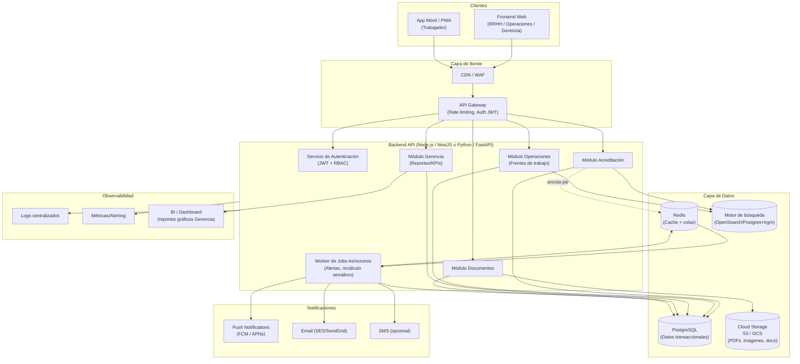

# Documentación Técnica Maestra
## Sistema de Gestión de Acreditación, Operaciones y Gerencia — Rubro Minero

**Versión:** 1.0
**Autor:** Arquitectura de Software / Tech Lead
**Fecha:** Agosto 2026
**Estado:** Base de diseño para desarrollo (Fase 0 → Fase 1)

---

## Índice

1. [Especificación de Requerimientos de Software (SRS)](#1-especificación-de-requerimientos-de-software-srs)
2. [Modelo de Datos y Entidad-Relación (ERD)](#2-modelo-de-datos-y-entidad-relación-erd)
3. [Arquitectura del Sistema y Stack Tecnológico](#3-arquitectura-del-sistema-y-stack-tecnológico)
4. [Diseño de Endpoints y Contratos de API (REST)](#4-diseño-de-endpoints-y-contratos-de-api-rest)
5. [Estrategia UX/UI y Sistema de Tematización](#5-estrategia-uxui--sistema-de-tematización)

---

# 1. Especificación de Requerimientos de Software (SRS)

## 1.1 Propósito y alcance

El sistema centraliza la gestión documental y de acreditación del personal (conductores, mecánicos, cocineros, supervisores, transportistas, etc.) que ingresa a operar en unidades mineras, reemplazando el manejo manual en Excel/Drive por una plataforma con base de datos, alertas automáticas de vencimiento, motor de reglas de "semáforo", armado de cuadrillas y reportería gerencial con aislamiento estricto de datos entre trabajadores.

El sistema debe ser **multi-tenant por empresa** y **multi-cliente por minera**, dado que una misma empresa contratista trabaja para varias mineras, cada una con requisitos documentales distintos y una identidad visual propia.

## 1.2 Actores del sistema

| Actor | Descripción | Objetivo principal |
|---|---|---|
| **Administrador de Acreditación (RRHH)** | Gestiona el ingreso de trabajadores, carga y valida documentos, define cursos requeridos por cargo/minera. | Reducir el tiempo de acreditación y evitar vencimientos no detectados. |
| **Operaciones** | Arma frentes de trabajo/cuadrillas, programa personal para escoltas/turnos, busca personal disponible por competencia. | Garantizar que solo se programe personal "100% verde" y tener trazabilidad de cuadrillas. |
| **Gerencia** | Supervisa KPIs globales, revisa cuántos trabajadores están al 100%, tiempos de habilitación (lead time), reportes por minera. | Tomar decisiones con datos agregados y gráficos, presionar sobre déficits de personal. |
| **Trabajador (App móvil)** | Consulta sus propios documentos, cursos por vencer, vencidos y su estado (semáforo). | Visibilidad clara y simple de su propio estatus, sin ver datos de terceros. |
| **Administrador de Sistema (Super Admin)** | Configura empresas, mineras, matrices de requisitos por cargo-minera, theming, roles y permisos. | Mantener la configuración multi-tenant del sistema. |

## 1.3 Casos de uso clave

### CU-01 — Registrar nuevo trabajador y su expediente documental
**Actor:** RRHH / Acreditación
**Flujo principal:**
1. RRHH crea el registro del trabajador (datos personales, DNI, cargo(s)/tags).
2. Sube documentos requeridos (antecedentes penales/policiales, examen médico, licencia de conducir, certificados de cursos), cada uno con fecha de emisión y fecha de vencimiento.
3. El sistema calcula automáticamente el estado semáforo de cada documento y el estado agregado del trabajador.
4. El sistema determina, según el cargo y la minera destino, qué documentos faltan (matriz de requisitos).
**Postcondición:** El trabajador queda con un expediente digital indexado y buscable.
**Reglas aplicadas:** RN-01, RN-02, RN-05.

### CU-02 — Buscar trabajadores por apellido con alerta de vencimientos
**Actor:** RRHH / Operaciones
**Flujo principal:**
1. El usuario busca por apellido (o nombre parcial).
2. El sistema retorna la ficha del trabajador con badges de color por cada curso/documento (verde, amarillo, rojo).
3. Si hay documentos vencidos o próximos a vencer, se muestra una alerta visual destacada en la ficha.
**Reglas aplicadas:** RN-01.

### CU-03 — Consultar y filtrar matriz de cumplimiento (bulk)
**Actor:** RRHH / Gerencia
**Flujo principal:**
1. El usuario selecciona una minera y/o cargo.
2. El sistema muestra una matriz (Trabajador × Documento requerido) con el estado de cada celda, reemplazando la revisión manual de Excel.
3. Permite exportar a Excel/PDF y filtrar por estado (solo vencidos, solo próximos a vencer, solo 100%).
**Reglas aplicadas:** RN-01, RN-02.

### CU-04 — Buscar personal disponible por competencia/rol para armar cuadrillas
**Actor:** Operaciones
**Flujo principal:**
1. Operaciones busca, por ejemplo, "20 mecánicos disponibles".
2. El sistema filtra trabajadores cuyo conjunto de tags/competencias incluya "Mecánico" (independientemente de si también tienen tags de "Supervisor" o "Electricista"), evitando duplicar o etiquetar erróneamente a alguien con cargo compuesto.
3. El sistema excluye automáticamente a quienes no estén en estado "100% verde" si el filtro de disponibilidad está activo.
4. El resultado indica cuántos matches hay vs. cuántos se necesitan (déficit).
**Reglas aplicadas:** RN-03, RN-04.

### CU-05 — Armar frente de trabajo / cuadrilla con trazabilidad
**Actor:** Operaciones
**Flujo principal:**
1. Operaciones crea un "Frente de Trabajo" para un rango de fechas y minera.
2. Asigna un líder y ayudantes (roles dentro de la cuadrilla), diferenciando personal fijo (asignación permanente) de intermitente (asignación por evento/día).
3. Al intentar agregar un trabajador, el sistema valida en tiempo real su estado semáforo.
4. Si el trabajador no está "100% verde" (o tiene un documento venciendo dentro de la ventana configurada, ej. próximos 30 días), el sistema **bloquea la asignación** y muestra el motivo específico (qué documento y en cuántos días vence).
**Reglas aplicadas:** RN-04 (validación restrictiva), RN-01.
**Flujo alterno:** Un supervisor con permiso elevado puede forzar la asignación dejando una justificación registrada en auditoría (override controlado, opcional configurable por empresa).

### CU-06 — Notificar vencimientos próximos (alertas proactivas)
**Actor:** Sistema (job automático) → RRHH, Operaciones, Trabajador
**Flujo principal:**
1. Un proceso batch diario evalúa todos los documentos vigentes.
2. Genera notificaciones (push app móvil, email, dashboard) cuando un documento entra en ventana "amarillo" (≤30 días) y cuando pasa a "rojo" (vencido).
3. Si el trabajador es transportista y su vencimiento bloquea convoy, se notifica también a Operaciones con prioridad alta.
**Reglas aplicadas:** RN-01, RN-06.

### CU-07 — Reporte gerencial de % de personal al 100% y lead time de habilitación
**Actor:** Gerencia
**Flujo principal:**
1. Gerencia selecciona minera, empresa, rango de fechas y/o cargo.
2. El sistema calcula: cantidad y % de trabajadores al 100%, distribución por semáforo, tiempo promedio (lead time) desde el ingreso del trabajador hasta alcanzar el 100% de habilitación.
3. Se presentan gráficos (barras, tendencia temporal, dona por estado).
**Reglas aplicadas:** RN-02, RN-07.

### CU-08 — Evaluar candidato para un cargo específico
**Actor:** Gerencia / RRHH
**Flujo principal:**
1. Se selecciona un trabajador y un cargo objetivo dentro de una minera.
2. El sistema compara el expediente del trabajador contra la matriz de requisitos del cargo-minera y retorna: cumple / no cumple, y el detalle de qué falta.
**Reglas aplicadas:** RN-02, RN-05.

### CU-09 — Consultar mi estado (App móvil del trabajador)
**Actor:** Trabajador
**Flujo principal:**
1. El trabajador inicia sesión (autenticación individual, biométrica u OTP recomendada dado el bajo perfil tecnológico).
2. Ve únicamente sus propios documentos, con colores (verde/amarillo/rojo), fechas de vencimiento y qué le falta.
3. No puede ver, buscar ni inferir datos de otros trabajadores bajo ninguna vista.
**Reglas aplicadas:** RN-01, RN-08 (aislamiento de datos).

### CU-10 — Configurar matriz de requisitos por Empresa–Minera–Cargo
**Actor:** Super Admin / Gerencia
**Flujo principal:**
1. Se define, por cada combinación Minera + Cargo, la lista de documentos/cursos obligatorios y opcionales (ej. Minera X exige 1 curso para transportista; Minera Y exige 20).
2. Esta matriz alimenta automáticamente el cálculo de cumplimiento (CU-01, CU-03, CU-08).
**Reglas aplicadas:** RN-05.

## 1.4 Reglas de negocio (detalladas)

### RN-01 — Lógica del semáforo (por documento/curso)
Cada documento/curso tiene una `fecha_vencimiento`. El estado se calcula como:

```
dias_restantes = fecha_vencimiento - fecha_actual

SI dias_restantes < 0          → ROJO   (VENCIDO)
SI 0 <= dias_restantes <= 30   → AMARILLO (PRÓXIMO A VENCER)
SI dias_restantes > 30         → VERDE  (VIGENTE)
```

- El umbral de 30 días debe ser **configurable por empresa y/o por tipo de documento** (tabla de configuración, no hardcodeado), ya que distintas mineras pueden exigir ventanas distintas (ej. 45 días para licencias de conducir).
- Un documento sin fecha de vencimiento registrada (pendiente de carga) se considera **ROJO/"Incompleto"** por defecto — nunca se asume vigente.

### RN-02 — Cálculo de "Personal al 100%"
Un trabajador está **100% habilitado** para un contexto (Empresa + Minera + Cargo) si y solo si:

1. **Todos** los documentos/cursos marcados como *obligatorios* en la matriz de requisitos de ese Cargo-Minera existen y están en estado **VERDE**.
2. No existe ningún documento obligatorio faltante (no cargado) o vencido.
3. Los documentos *opcionales* no afectan el cálculo del 100%, pero se muestran informativamente.

```
100% = (documentos_obligatorios_en_verde == total_documentos_obligatorios_requeridos)
```

El "100%" es siempre relativo a un contexto Cargo+Minera; un trabajador puede estar 100% para la Minera X (1 curso requerido) y no estarlo para la Minera Y (20 cursos requeridos) simultáneamente. El sistema debe guardar y exponer este cálculo por contexto, no como un booleano global del trabajador.

**Progreso parcial** (para reportes gerenciales de avance):
```
% avance = (documentos_obligatorios_en_verde / total_documentos_obligatorios_requeridos) * 100
```

### RN-03 — Búsqueda por competencia sin colisión de etiquetas combinadas
- Un cargo compuesto (ej. "Mecánico-Supervisor-Electricista") **no se almacena como un único string concatenado**. Se modela como una relación N:M `trabajador_tag` entre el trabajador y una tabla maestra de `tags/competencias` (Mecánico, Supervisor, Electricista, etc.).
- La búsqueda "necesito 20 mecánicos" filtra por `EXISTS tag = 'Mecánico'` en la relación, sin importar cuántos otros tags tenga esa persona ni el orden en que fueron asignados.
- Un trabajador puede tener 1 a N tags. Ningún tag es "principal" por defecto salvo que se marque explícitamente un `tag_principal` para fines de reporte (opcional).

### RN-04 — Validación restrictiva de programación de frentes de trabajo
Al intentar asignar (programar) a un trabajador a un frente de trabajo/escolta:

```
SI estado_semaforo_contexto(trabajador, minera_destino) != "VERDE_TOTAL" (100%)
   ENTONCES bloquear_asignacion()
   Y mostrar: lista de documentos causantes + días restantes o días vencidos

SI override_habilitado_para_rol(usuario_actual) == true
   ENTONCES permitir asignación forzada
   Y registrar en auditoría: usuario, motivo, timestamp, documento(s) en riesgo
```

- Por defecto, la validación es **bloqueante dura** (no solo advertencia) para Operaciones, ya que el requerimiento explícito es "no permitir la programación".
- El override solo debe habilitarse por configuración de empresa y con perfil autorizado (ej. Jefe de Operaciones), quedando 100% trazado.

### RN-05 — Matriz de requisitos dinámica (Empresa × Minera × Cargo × Documento)
- Cada Minera define su propia lista de documentos requeridos por Cargo (relación N:M configurable), y estos requisitos son independientes entre mineras aun para el mismo cargo.
- Un documento puede ser `obligatorio` u `opcional` dentro de esa combinación específica.
- Los cambios en la matriz de requisitos **no se aplican retroactivamente** de forma destructiva: se versiona (ver `matriz_requisito_version`) para poder auditar bajo qué reglas se acreditó a alguien en el pasado.

### RN-06 — Bloqueo de convoy / transportistas
- Si un trabajador transportista tiene un curso obligatorio vencido, su perfil pasa a estado `BLOQUEADO_TRANSPORTE`.
- El sistema debe permitir marcar la relación entre trabajadores transportistas y su convoy/unidad vehicular, de modo que un bloqueo individual pueda escalar como alerta a nivel de convoy (para que Operaciones anticipe el impacto operativo, ej. pagos/gestiones pendientes).

### RN-07 — Lead time de habilitación
```
lead_time_dias = fecha_alcanzo_100% - fecha_ingreso_trabajador
```
Se calcula por trabajador y contexto (Minera+Cargo), y se agrega (promedio, mediana, percentil 90) para reportes gerenciales por minera, cargo y periodo.

### RN-08 — Aislamiento de datos entre trabajadores (privacidad)
- La app móvil del trabajador **nunca** expone endpoints de búsqueda o listado de otros trabajadores.
- A nivel de backend, toda consulta desde un token de rol `TRABAJADOR` se filtra obligatoriamente por `trabajador_id = current_user.trabajador_id` (enforced a nivel de política de autorización, no solo en frontend).
- Ver detalle en sección 3.3 (seguridad y aislamiento).

## 1.5 Requerimientos no funcionales

| Categoría | Requerimiento |
|---|---|
| Usabilidad | Interfaz móvil apta para usuarios 40–60 años: tipografía grande, contraste alto, mínimo de pasos por flujo, iconografía + color redundante (no depender solo del color). |
| Disponibilidad | 99.5% uptime para consulta; el job de alertas debe tener reintentos y monitoreo. |
| Seguridad | Aislamiento estricto por rol; cifrado en tránsito (TLS) y en reposo para documentos sensibles (antecedentes penales, exámenes médicos). |
| Escalabilidad | Soportar 500–5,000+ trabajadores, múltiples empresas y mineras, sin degradación de búsquedas (índices, paginación). |
| Auditoría | Todo override, edición de documento y cambio de matriz de requisitos debe quedar en log inmutable (quién, cuándo, qué). |
| Portabilidad de datos | Exportación de matrices a Excel/PDF para reuniones y auditorías externas de la minera. |
| Multi-tenant | Aislamiento lógico de datos entre empresas distintas que usan el sistema (si aplica a futuro modelo SaaS). |

---

# 2. Modelo de Datos y Entidad-Relación (ERD)

## 2.1 Diagrama conceptual (Mermaid)

```mermaid
erDiagram
    EMPRESA ||--o{ TRABAJADOR : emplea
    EMPRESA ||--o{ EMPRESA_MINERA : "trabaja para"
    MINERA ||--o{ EMPRESA_MINERA : "es cliente de"
    MINERA ||--o{ MINERA_TEMA : tiene
    MINERA ||--o{ MATRIZ_REQUISITO : define

    CARGO ||--o{ MATRIZ_REQUISITO : "requiere para"
    DOCUMENTO_TIPO ||--o{ MATRIZ_REQUISITO : "es requerido en"

    TRABAJADOR ||--o{ TRABAJADOR_TAG : posee
    TAG ||--o{ TRABAJADOR_TAG : "asignado a"

    TRABAJADOR ||--o{ DOCUMENTO : sube
    DOCUMENTO_TIPO ||--o{ DOCUMENTO : "es instancia de"

    TRABAJADOR ||--o{ FRENTE_TRABAJO_MIEMBRO : participa
    FRENTE_TRABAJO ||--o{ FRENTE_TRABAJO_MIEMBRO : incluye
    MINERA ||--o{ FRENTE_TRABAJO : "aloja"

    TRABAJADOR ||--o{ TRABAJADOR_ESTADO_CONTEXTO : "tiene estado en"
    MINERA ||--o{ TRABAJADOR_ESTADO_CONTEXTO : contextualiza
    CARGO ||--o{ TRABAJADOR_ESTADO_CONTEXTO : contextualiza

    TRABAJADOR ||--o{ CONVOY_MIEMBRO : integra
    CONVOY ||--o{ CONVOY_MIEMBRO : agrupa

    USUARIO ||--o{ AUDITORIA_LOG : genera
    USUARIO ||--o{ FRENTE_TRABAJO_MIEMBRO : "override por"

    EMPRESA {
        uuid id PK
        string razon_social
        string ruc
        timestamp created_at
    }

    MINERA {
        uuid id PK
        string nombre
        string color_primario
        string color_secundario
        string logo_url
    }

    EMPRESA_MINERA {
        uuid id PK
        uuid empresa_id FK
        uuid minera_id FK
        boolean activo
    }

    MINERA_TEMA {
        uuid id PK
        uuid minera_id FK
        string color_hex
        string tipografia
        string modo
    }

    TRABAJADOR {
        uuid id PK
        uuid empresa_id FK
        string nombres
        string apellidos
        string dni UK
        date fecha_nacimiento
        date fecha_ingreso
        string telefono
        string estado_general
        timestamp created_at
    }

    TAG {
        uuid id PK
        string nombre UK
        string categoria
    }

    TRABAJADOR_TAG {
        uuid id PK
        uuid trabajador_id FK
        uuid tag_id FK
        boolean es_principal
        timestamp asignado_en
    }

    CARGO {
        uuid id PK
        string nombre UK
        string descripcion
    }

    DOCUMENTO_TIPO {
        uuid id PK
        string nombre
        string categoria
        int ventana_alerta_dias
        boolean requiere_vencimiento
    }

    MATRIZ_REQUISITO {
        uuid id PK
        uuid minera_id FK
        uuid cargo_id FK
        uuid documento_tipo_id FK
        boolean obligatorio
        int version
        timestamp vigente_desde
        timestamp vigente_hasta
    }

    DOCUMENTO {
        uuid id PK
        uuid trabajador_id FK
        uuid documento_tipo_id FK
        string archivo_url
        string archivo_hash
        date fecha_emision
        date fecha_vencimiento
        string estado_semaforo
        uuid subido_por FK
        timestamp created_at
    }

    TRABAJADOR_ESTADO_CONTEXTO {
        uuid id PK
        uuid trabajador_id FK
        uuid minera_id FK
        uuid cargo_id FK
        decimal porcentaje_avance
        boolean es_100_porciento
        date fecha_alcanzo_100
        timestamp calculado_en
    }

    FRENTE_TRABAJO {
        uuid id PK
        uuid minera_id FK
        string nombre
        date fecha_inicio
        date fecha_fin
        string estado
    }

    FRENTE_TRABAJO_MIEMBRO {
        uuid id PK
        uuid frente_trabajo_id FK
        uuid trabajador_id FK
        string rol_en_frente
        string tipo_asignacion
        boolean fue_override
        uuid override_por FK
        string override_motivo
        timestamp asignado_en
    }

    CONVOY {
        uuid id PK
        string codigo UK
        uuid minera_id FK
        string estado
    }

    CONVOY_MIEMBRO {
        uuid id PK
        uuid convoy_id FK
        uuid trabajador_id FK
        timestamp asignado_en
    }

    USUARIO {
        uuid id PK
        string email UK
        string rol
        uuid empresa_id FK
        uuid trabajador_id FK
        boolean activo
    }

    AUDITORIA_LOG {
        uuid id PK
        uuid usuario_id FK
        string accion
        string entidad
        uuid entidad_id
        jsonb detalle
        timestamp created_at
    }
```



## 2.2 Definición detallada de tablas

### `empresa`
| Columna | Tipo | Restricciones |
|---|---|---|
| id | UUID | PK |
| razon_social | VARCHAR(200) | NOT NULL |
| ruc | VARCHAR(20) | UNIQUE, NOT NULL |
| created_at | TIMESTAMP | DEFAULT now() |

### `minera`
| Columna | Tipo | Restricciones |
|---|---|---|
| id | UUID | PK |
| nombre | VARCHAR(150) | NOT NULL, UNIQUE |
| color_primario | VARCHAR(7) | ej. `#0033A0` (Antapacay azul) |
| color_secundario | VARCHAR(7) | ej. `#E8720C` (Las Bambas naranja) |
| logo_url | TEXT | |

### `empresa_minera` (N:M empresa-minera)
| Columna | Tipo | Restricciones |
|---|---|---|
| id | UUID | PK |
| empresa_id | UUID | FK → empresa.id, NOT NULL |
| minera_id | UUID | FK → minera.id, NOT NULL |
| activo | BOOLEAN | DEFAULT true |
| **Índice único** | | `(empresa_id, minera_id)` |

### `trabajador`
| Columna | Tipo | Restricciones |
|---|---|---|
| id | UUID | PK |
| empresa_id | UUID | FK → empresa.id, NOT NULL |
| nombres | VARCHAR(120) | NOT NULL |
| apellidos | VARCHAR(120) | NOT NULL |
| dni | VARCHAR(15) | UNIQUE, NOT NULL |
| fecha_nacimiento | DATE | |
| fecha_ingreso | DATE | NOT NULL — base para RN-07 |
| telefono | VARCHAR(20) | |
| estado_general | VARCHAR(20) | ENUM: `ACTIVO, INACTIVO, BLOQUEADO_TRANSPORTE` |
| created_at | TIMESTAMP | DEFAULT now() |
| **Índices** | | `idx_trabajador_apellidos (apellidos)` (búsqueda CU-02, usar `pg_trgm` para búsqueda difusa), `idx_trabajador_empresa (empresa_id)` |

### `tag` (competencias/roles)
| Columna | Tipo | Restricciones |
|---|---|---|
| id | UUID | PK |
| nombre | VARCHAR(80) | UNIQUE, NOT NULL (ej. "Mecánico", "Supervisor", "Electricista", "Cocinero", "Conductor") |
| categoria | VARCHAR(50) | ej. "Operativo", "Seguridad" |

### `trabajador_tag` (N:M — resuelve el problema de cargos combinados)
| Columna | Tipo | Restricciones |
|---|---|---|
| id | UUID | PK |
| trabajador_id | UUID | FK → trabajador.id, NOT NULL |
| tag_id | UUID | FK → tag.id, NOT NULL |
| es_principal | BOOLEAN | DEFAULT false |
| asignado_en | TIMESTAMP | DEFAULT now() |
| **Índice único** | | `(trabajador_id, tag_id)` |
| **Índice** | | `idx_trabajador_tag_tag (tag_id)` — acelera búsquedas "todos los Mecánico" |

### `cargo`
| Columna | Tipo | Restricciones |
|---|---|---|
| id | UUID | PK |
| nombre | VARCHAR(100) | UNIQUE, NOT NULL |
| descripcion | TEXT | |

> Nota de diseño: `cargo` (puesto formal contractual) es distinto de `tag` (competencia real de la persona). Un trabajador tiene un `cargo` principal para efectos de planilla, pero sus `tags` reflejan todas sus competencias reales, permitiendo búsquedas flexibles sin importar el cargo contractual.

### `documento_tipo` (catálogo maestro: DNI, antecedentes, examen médico, licencia, curso X, curso Y…)
| Columna | Tipo | Restricciones |
|---|---|---|
| id | UUID | PK |
| nombre | VARCHAR(150) | NOT NULL |
| categoria | VARCHAR(50) | ENUM: `IDENTIDAD, ANTECEDENTE, MEDICO, LICENCIA, CURSO` |
| ventana_alerta_dias | INT | DEFAULT 30 — configurable (RN-01) |
| requiere_vencimiento | BOOLEAN | DEFAULT true (DNI podría no vencer, por ejemplo) |

### `matriz_requisito` (el corazón de la personalización por minera — resuelve N:M dinámico)
| Columna | Tipo | Restricciones |
|---|---|---|
| id | UUID | PK |
| minera_id | UUID | FK → minera.id, NOT NULL |
| cargo_id | UUID | FK → cargo.id, NOT NULL |
| documento_tipo_id | UUID | FK → documento_tipo.id, NOT NULL |
| obligatorio | BOOLEAN | DEFAULT true |
| version | INT | NOT NULL, DEFAULT 1 (RN-05 versionado) |
| vigente_desde | TIMESTAMP | NOT NULL |
| vigente_hasta | TIMESTAMP | NULL = vigente actualmente |
| **Índice único** | | `(minera_id, cargo_id, documento_tipo_id, version)` |
| **Índice** | | `idx_matriz_activa (minera_id, cargo_id) WHERE vigente_hasta IS NULL` |

### `documento` (instancia real subida por el trabajador)
| Columna | Tipo | Restricciones |
|---|---|---|
| id | UUID | PK |
| trabajador_id | UUID | FK → trabajador.id, NOT NULL |
| documento_tipo_id | UUID | FK → documento_tipo.id, NOT NULL |
| archivo_url | TEXT | NOT NULL (ruta en storage cloud) |
| archivo_hash | VARCHAR(64) | integridad/anti-duplicado |
| fecha_emision | DATE | |
| fecha_vencimiento | DATE | NULL permitido solo si `requiere_vencimiento=false` |
| estado_semaforo | VARCHAR(10) | ENUM: `VERDE, AMARILLO, ROJO` — calculado, cacheado y recalculado por job diario |
| subido_por | UUID | FK → usuario.id |
| created_at | TIMESTAMP | DEFAULT now() |
| **Índices** | | `idx_documento_trabajador (trabajador_id)`, `idx_documento_vencimiento (fecha_vencimiento)` (crítico para el job de alertas), `idx_documento_estado (estado_semaforo)` |

### `trabajador_estado_contexto` (tabla derivada/cache — resuelve RN-02 y RN-07 de forma performante)
| Columna | Tipo | Restricciones |
|---|---|---|
| id | UUID | PK |
| trabajador_id | UUID | FK → trabajador.id, NOT NULL |
| minera_id | UUID | FK → minera.id, NOT NULL |
| cargo_id | UUID | FK → cargo.id, NOT NULL |
| porcentaje_avance | DECIMAL(5,2) | 0–100 |
| es_100_porciento | BOOLEAN | recalculado por job/trigger |
| fecha_alcanzo_100 | DATE | NULL hasta que ocurra; usado para lead time |
| calculado_en | TIMESTAMP | |
| **Índice único** | | `(trabajador_id, minera_id, cargo_id)` |

> Esta tabla es una **proyección materializada** (recalculada por trigger al insertar/actualizar `documento`, o por job batch cada N minutos) para que las consultas de Gerencia y Operaciones (CU-03, CU-04, CU-07) no tengan que recalcular sobre la marcha uniendo `matriz_requisito` + `documento` en tiempo real para miles de registros.

### `frente_trabajo`
| Columna | Tipo | Restricciones |
|---|---|---|
| id | UUID | PK |
| minera_id | UUID | FK → minera.id |
| nombre | VARCHAR(150) | |
| fecha_inicio | DATE | NOT NULL |
| fecha_fin | DATE | |
| estado | VARCHAR(20) | ENUM: `PLANIFICADO, ACTIVO, CERRADO` |

### `frente_trabajo_miembro` (trazabilidad de cuadrillas — resuelve líder/ayudantes, fijo/intermitente)
| Columna | Tipo | Restricciones |
|---|---|---|
| id | UUID | PK |
| frente_trabajo_id | UUID | FK → frente_trabajo.id, NOT NULL |
| trabajador_id | UUID | FK → trabajador.id, NOT NULL |
| rol_en_frente | VARCHAR(20) | ENUM: `LIDER, AYUDANTE` |
| tipo_asignacion | VARCHAR(20) | ENUM: `FIJO, INTERMITENTE` |
| fue_override | BOOLEAN | DEFAULT false (RN-04) |
| override_por | UUID | FK → usuario.id, NULL si no hubo override |
| override_motivo | TEXT | NULL si no hubo override |
| asignado_en | TIMESTAMP | DEFAULT now() |
| **Índice** | | `idx_ftm_frente (frente_trabajo_id)`, `idx_ftm_trabajador (trabajador_id)` |

### `convoy` y `convoy_miembro` (RN-06)
| Tabla | Columnas clave |
|---|---|
| convoy | id PK, codigo UK, minera_id FK, estado (`ACTIVO`, `DETENIDO`) |
| convoy_miembro | id PK, convoy_id FK, trabajador_id FK, asignado_en |

### `usuario` (identidad de acceso — separado de `trabajador`)
| Columna | Tipo | Restricciones |
|---|---|---|
| id | UUID | PK |
| email | VARCHAR(150) | UNIQUE, NOT NULL |
| rol | VARCHAR(20) | ENUM: `SUPER_ADMIN, RRHH, OPERACIONES, GERENCIA, TRABAJADOR` |
| empresa_id | UUID | FK → empresa.id, NULL si SUPER_ADMIN |
| trabajador_id | UUID | FK → trabajador.id, **solo si rol = TRABAJADOR** (1:1) |
| activo | BOOLEAN | DEFAULT true |

### `auditoria_log`
| Columna | Tipo | Restricciones |
|---|---|---|
| id | UUID | PK |
| usuario_id | UUID | FK → usuario.id |
| accion | VARCHAR(50) | ej. `OVERRIDE_ASIGNACION`, `EDITAR_DOCUMENTO`, `CAMBIO_MATRIZ` |
| entidad | VARCHAR(50) | tabla afectada |
| entidad_id | UUID | registro afectado |
| detalle | JSONB | payload antes/después |
| created_at | TIMESTAMP | DEFAULT now() |
| **Índice** | | `idx_auditoria_entidad (entidad, entidad_id)`, `idx_auditoria_fecha (created_at)` |

## 2.3 Notas de diseño clave del modelo

- **Matriz N:M resuelta en 3 niveles**: `matriz_requisito` (config: qué se requiere) separa la **configuración** de la **instancia real** (`documento`, lo que el trabajador efectivamente subió). Esto evita mezclar "requisito" con "cumplimiento", y permite auditar cambios de requisitos sin perder el histórico de qué se le exigió a cada trabajador en su momento (versión + vigente_desde/hasta).
- **Tags vs. Cargo**: separa el "puesto contractual" (1 por trabajador, para planilla/legal) de las "competencias reales" (N por trabajador, para búsqueda operativa), resolviendo directamente el problema descrito de cargos combinados tipo "Mecánico-Supervisor-Electricista".
- **Estado materializado (`trabajador_estado_contexto`)**: evita calcular el semáforo agregado de 500-5,000 trabajadores en tiempo real en cada búsqueda; se recalcula vía trigger/job y se lee rápido con índice único.
- **Auditoría desacoplada**: cualquier entidad puede loggear en `auditoria_log` vía `entidad` + `entidad_id`, evitando tener una tabla de auditoría por cada entidad de negocio.

---

# 3. Arquitectura del Sistema y Stack Tecnológico

## 3.1 Diagrama de arquitectura (Mermaid)



## 3.2 Stack tecnológico recomendado

| Capa | Tecnología recomendada | Justificación |
|---|---|---|
| **Backend API** | Node.js + NestJS (TypeScript) *o* Python + FastAPI | Ambos con soporte maduro para RBAC, validación de esquemas, y ORM tipado. NestJS aporta arquitectura modular (Módulo Acreditación, Operaciones, Gerencia) alineada al dominio. |
| **Base de datos principal** | PostgreSQL 15+ | Soporta JSONB (auditoría), `pg_trgm` (búsqueda difusa por apellido), particionamiento, integridad referencial fuerte para el modelo relacional complejo (N:M matriz de requisitos). |
| **Cache / Colas** | Redis | Cache de estados semáforo pre-calculados y cola de jobs (BullMQ / Celery) para el job diario de alertas de vencimiento. |
| **Storage de documentos** | AWS S3 / Google Cloud Storage | Almacenamiento de PDFs/imágenes de antecedentes, exámenes médicos, licencias, con URLs firmadas de corta duración (evita exposición directa de documentos sensibles). |
| **Búsqueda** | PostgreSQL + `pg_trgm`/`GIN` (fase inicial) → OpenSearch (si escala a >10K trabajadores o búsqueda full-text avanzada) | Empezar simple; migrar solo si el volumen lo exige. |
| **Frontend Web** | React + TypeScript + TailwindCSS | Theming dinámico por variables CSS (necesario para RN de colores por minera), ecosistema maduro para dashboards con gráficos (Recharts/Chart.js). |
| **App Móvil** | PWA (Progressive Web App) con React, o React Native si se requiere acceso nativo (cámara para subir documentos, notificaciones push nativas) | Dado el perfil de usuario 40-60 años, una PWA instalable reduce fricción de descarga vs. app store, pero React Native da mejores push notifications nativas — **decisión a validar con negocio en Fase 1**. |
| **Autenticación** | JWT + Refresh Tokens, OAuth2/OIDC si se integra con SSO corporativo | RBAC por rol (`SUPER_ADMIN, RRHH, OPERACIONES, GERENCIA, TRABAJADOR`). |
| **Notificaciones push** | Firebase Cloud Messaging (Android) / APNs (iOS) | Estándar de mercado, integración directa con PWA/React Native. |
| **Email transaccional** | AWS SES / SendGrid | Alertas de vencimiento por email para RRHH/Operaciones. |
| **Jobs asíncronos** | BullMQ (Node) o Celery (Python) sobre Redis | Ejecuta el cálculo diario de semáforo y disparo de notificaciones sin bloquear la API. |
| **Infraestructura** | Contenedores Docker + Kubernetes (o ECS/Cloud Run para equipos más pequeños) | Facilita despliegue multi-servicio y escalado horizontal del Worker en picos (recalculo masivo). |
| **CI/CD** | GitHub Actions / GitLab CI | Pipelines de test + build + deploy. |
| **Observabilidad** | Grafana + Prometheus / Datadog, Sentry para errores | Monitoreo del job de alertas (crítico: si falla, nadie se entera de vencimientos). |
| **Reportería/BI** | Recharts/Chart.js embebido en el frontend para KPIs de Gerencia; opcional Metabase para análisis ad-hoc | Cumple el requerimiento explícito de "reportes con gráficos sí o sí". |

## 3.3 Estrategia de seguridad y aislamiento estricto de datos

### 3.3.1 Autenticación y autorización
- **JWT** con claims: `usuario_id`, `rol`, `empresa_id`, y — crítico — `trabajador_id` cuando `rol = TRABAJADOR`.
- **RBAC + Row-Level Security (RLS) a nivel de PostgreSQL** como segunda capa de defensa (no confiar solo en el filtro de la capa de aplicación):
  ```sql
  CREATE POLICY trabajador_solo_su_data ON documento
    FOR SELECT
    USING (
      current_setting('app.rol') != 'TRABAJADOR'
      OR trabajador_id = current_setting('app.trabajador_id')::uuid
    );
  ```
- Esto garantiza que, aunque exista un bug en el código de aplicación, la base de datos **nunca** retorna documentos de otro trabajador a una sesión con rol `TRABAJADOR`.

### 3.3.2 Aislamiento a nivel de API (defensa en profundidad)
- Todo endpoint bajo `/mobile/*` (consumido por la app del trabajador) **ignora cualquier `trabajador_id` recibido en el request** y siempre usa el `trabajador_id` del token JWT.
- No existen endpoints de listado/búsqueda de trabajadores accesibles desde el rol `TRABAJADOR`.
- Rate limiting agresivo en endpoints móviles para evitar enumeración de IDs.

### 3.3.3 Protección de documentos sensibles
- Antecedentes penales y exámenes médicos son datos sensibles: se almacenan en un bucket separado con cifrado server-side (SSE-KMS) y se acceden solo vía **URLs firmadas de corta duración** (ej. 5 minutos), nunca URLs públicas permanentes.
- Los documentos nunca se referencian por ruta predecible (usar UUID, no `dni/documento.pdf`).

### 3.3.4 Aislamiento multi-tenant (empresa/minera)
- Todo query de negocio se filtra adicionalmente por `empresa_id` del usuario autenticado (excepto `SUPER_ADMIN`).
- Un usuario de `OPERACIONES` de la Empresa A nunca puede ver trabajadores de la Empresa B, incluso si comparten la misma minera cliente.

### 3.3.5 Auditoría y trazabilidad
- Toda acción sensible (override de asignación, edición de documento, cambio de matriz de requisitos, acceso a documentos de antecedentes) se registra en `auditoria_log` de forma inmutable (sin permisos de `UPDATE`/`DELETE` para roles de aplicación sobre esa tabla).

---

# 4. Diseño de Endpoints y Contratos de API (REST)

> Convención: base URL `/api/v1`. Autenticación vía header `Authorization: Bearer <JWT>`. Todas las respuestas de error siguen el formato `{ "error": { "code": "...", "message": "..." } }`.

## 4.1 Matriz de cumplimiento y semáforo del trabajador

### `GET /api/v1/trabajadores/{trabajador_id}/estado`
Devuelve el estado semáforo consolidado de un trabajador, por contexto (minera/cargo).

**Query params:** `minera_id` (opcional, si se omite retorna todos los contextos)

**Response 200:**
```json
{
  "trabajador": {
    "id": "b3f1...",
    "nombres": "Juan Carlos",
    "apellidos": "Quispe Mamani",
    "dni": "45678912",
    "estado_general": "ACTIVO"
  },
  "contextos": [
    {
      "minera": { "id": "m-001", "nombre": "Antapacay", "color_primario": "#0033A0" },
      "cargo": { "id": "c-003", "nombre": "Transportista" },
      "porcentaje_avance": 90.0,
      "es_100_porciento": false,
      "documentos": [
        {
          "documento_tipo": "Licencia de Conducir Clase A-III",
          "obligatorio": true,
          "estado_semaforo": "AMARILLO",
          "fecha_vencimiento": "2026-09-15",
          "dias_restantes": 20
        },
        {
          "documento_tipo": "Examen Médico Ocupacional",
          "obligatorio": true,
          "estado_semaforo": "VERDE",
          "fecha_vencimiento": "2027-02-01",
          "dias_restantes": 159
        }
      ]
    }
  ]
}
```

### `GET /api/v1/matriz-cumplimiento`
Matriz bulk (Trabajador × Documento) para reemplazar el Excel manual (CU-03).

**Query params:** `minera_id` (req.), `cargo_id` (opcional), `apellido` (opcional, búsqueda), `solo_estado` (opcional: `VENCIDO|PROXIMO|100`), `page`, `page_size`

**Response 200:**
```json
{
  "meta": { "total": 480, "page": 1, "page_size": 50 },
  "columnas": ["DNI", "Antecedentes Penales", "Examen Médico", "Curso Manejo Defensivo"],
  "filas": [
    {
      "trabajador_id": "b3f1...",
      "apellidos_nombres": "Quispe Mamani, Juan Carlos",
      "es_100_porciento": false,
      "celdas": [
        { "documento_tipo": "DNI", "estado": "VERDE" },
        { "documento_tipo": "Antecedentes Penales", "estado": "ROJO", "dias": -5 },
        { "documento_tipo": "Examen Médico", "estado": "AMARILLO", "dias": 12 },
        { "documento_tipo": "Curso Manejo Defensivo", "estado": "VERDE" }
      ]
    }
  ]
}
```

### `GET /api/v1/mobile/mi-estado`  *(rol TRABAJADOR — usa trabajador_id del JWT, no recibe parámetro)*
**Response 200:** mismo esquema que `GET /trabajadores/{id}/estado`, pero resuelto internamente por el backend a partir del token; cualquier `trabajador_id` en la URL es ignorado/rechazado (403) si no coincide con el token.

### `POST /api/v1/documentos`
Sube/registra un nuevo documento para un trabajador.

**Request:**
```json
{
  "trabajador_id": "b3f1...",
  "documento_tipo_id": "dt-012",
  "fecha_emision": "2026-01-10",
  "fecha_vencimiento": "2027-01-10",
  "archivo_base64": "JVBERi0xLjQK..."
}
```
**Response 201:**
```json
{
  "id": "doc-9981",
  "estado_semaforo": "VERDE",
  "archivo_url": "https://storage.../signed-url",
  "mensaje": "Documento registrado correctamente"
}
```
**Response 422** (si `fecha_vencimiento` pasada al momento de la carga):
```json
{ "error": { "code": "DOCUMENTO_YA_VENCIDO", "message": "La fecha de vencimiento es anterior a hoy." } }
```

## 4.2 Búsqueda por competencias y armado de frentes de trabajo

### `GET /api/v1/trabajadores/buscar-por-competencia`
Implementa CU-04.

**Query params:** `tag` (repetible, ej. `tag=Mecanico`), `minera_id`, `solo_disponibles_100` (bool, default `true`), `cantidad_requerida` (opcional, para calcular déficit)

**Response 200:**
```json
{
  "criterio": { "tags": ["Mecanico"], "minera_id": "m-001", "solo_disponibles_100": true },
  "cantidad_requerida": 20,
  "cantidad_encontrada": 14,
  "deficit": 6,
  "trabajadores": [
    {
      "id": "b3f1...",
      "apellidos_nombres": "Quispe Mamani, Juan Carlos",
      "tags": ["Mecanico", "Supervisor"],
      "es_100_porciento": true,
      "tipo_asignacion_actual": "FIJO"
    }
  ]
}
```

### `POST /api/v1/frentes-trabajo`
Crea un frente de trabajo (cuadrilla).
```json
{
  "minera_id": "m-001",
  "nombre": "Frente Escolta Norte - Semana 35",
  "fecha_inicio": "2026-08-31",
  "fecha_fin": "2026-09-06"
}
```
**Response 201:** `{ "id": "ft-2201", "estado": "PLANIFICADO" }`

### `POST /api/v1/frentes-trabajo/{id}/miembros`
Implementa RN-04 (validación restrictiva) — endpoint crítico.

**Request:**
```json
{
  "trabajador_id": "b3f1...",
  "rol_en_frente": "AYUDANTE",
  "tipo_asignacion": "INTERMITENTE",
  "forzar_override": false,
  "override_motivo": null
}
```

**Response 201 (caso válido — trabajador 100% verde):**
```json
{
  "id": "ftm-771",
  "trabajador_id": "b3f1...",
  "estado_asignacion": "CONFIRMADA"
}
```

**Response 409 (bloqueado — regla RN-04, sin override):**
```json
{
  "error": {
    "code": "TRABAJADOR_NO_DISPONIBLE",
    "message": "El trabajador no está 100% habilitado para esta minera.",
    "detalle": {
      "documentos_bloqueantes": [
        { "documento_tipo": "Licencia de Conducir", "estado": "AMARILLO", "dias_restantes": 12 }
      ]
    }
  }
}
```

**Response 201 (override forzado — requiere `forzar_override: true` + `override_motivo` + permiso elevado):**
```json
{
  "id": "ftm-772",
  "estado_asignacion": "CONFIRMADA_CON_OVERRIDE",
  "auditoria_id": "aud-5521"
}
```

## 4.3 Reportes gerenciales

### `GET /api/v1/reportes/personal-100-porciento`
Implementa CU-07 (KPI principal de Gerencia).

**Query params:** `minera_id` (opcional), `cargo_id` (opcional), `empresa_id` (opcional), `desde`, `hasta`

**Response 200:**
```json
{
  "resumen": {
    "total_trabajadores": 540,
    "al_100_porciento": 402,
    "porcentaje_100": 74.4,
    "en_amarillo_pero_no_100": 98,
    "con_documentos_vencidos": 40
  },
  "distribucion_por_minera": [
    { "minera": "Antapacay", "total": 300, "al_100": 250, "porcentaje": 83.3 },
    { "minera": "Las Bambas", "total": 240, "al_100": 152, "porcentaje": 63.3 }
  ],
  "serie_temporal_avance": [
    { "fecha": "2026-06-01", "porcentaje_100": 68.1 },
    { "fecha": "2026-07-01", "porcentaje_100": 71.5 },
    { "fecha": "2026-08-01", "porcentaje_100": 74.4 }
  ]
}
```

### `GET /api/v1/reportes/lead-time-habilitacion`
Implementa RN-07.

**Query params:** `minera_id`, `cargo_id`, `desde`, `hasta`

**Response 200:**
```json
{
  "lead_time_promedio_dias": 27.4,
  "lead_time_mediana_dias": 24,
  "lead_time_p90_dias": 45,
  "muestra": 186,
  "detalle_por_cargo": [
    { "cargo": "Transportista", "promedio_dias": 32.1, "muestra": 60 },
    { "cargo": "Mecánico", "promedio_dias": 21.8, "muestra": 45 }
  ]
}
```

### `GET /api/v1/reportes/candidato-cargo`
Implementa CU-08.

**Query params:** `trabajador_id`, `cargo_id`, `minera_id`

**Response 200:**
```json
{
  "cumple": false,
  "porcentaje_avance": 85.0,
  "faltantes": [
    { "documento_tipo": "Curso NIOSH Espacios Confinados", "motivo": "NO_CARGADO" },
    { "documento_tipo": "Examen Médico", "motivo": "VENCIDO", "dias_vencido": 3 }
  ]
}
```

---

# 5. Estrategia UX/UI & Sistema de Tematización

## 5.1 Pautas de diseño — App Móvil (usuarios 40–60 años)

### Principios rectores
1. **Menos es más**: máximo 3-4 acciones visibles por pantalla. Evitar menús anidados profundos (máximo 2 niveles).
2. **Color + ícono + texto, nunca solo color**: cada estado semáforo se representa con color **Y** un ícono **Y** una etiqueta de texto ("✅ Vigente", "⚠️ Vence en 12 días", "❌ Vencido"), para usuarios con posible daltonismo o baja familiaridad con convenciones digitales.
3. **Tipografía grande y legible**: mínimo 16pt para texto de cuerpo, 20-24pt para títulos y estados críticos; alto contraste (WCAG AA mínimo, idealmente AAA en textos de alerta).
4. **Botones grandes y espaciados**: área táctil mínima 48x48dp, separación suficiente para evitar toques accidentales (dedos menos precisos, uso con guantes en campo).
5. **Feedback inmediato y claro**: cada acción (ej. subir un documento) confirma con mensaje simple y visual ("Tu documento fue enviado ✅"), evitando jerga técnica ("Error 500", "Payload inválido").
6. **Sin scroll infinito ni gestos complejos**: preferir listas paginadas simples y navegación por pestañas fijas en la parte inferior (Home / Mis Documentos / Notificaciones / Perfil).
7. **Modo "explicado"**: incluir textos de ayuda breves bajo cada sección (ej. "Aquí verás los cursos que debes renovar pronto") en lugar de depender de tooltips ocultos.
8. **Onboarding asistido**: primera vez que el trabajador entra, tutorial de 3 pantallas máximo, con opción de saltar, mostrando exactamente qué significa cada color.

### Pantalla principal — jerarquía visual sugerida
1. **Encabezado**: Foto/avatar + nombre + estado general (badge grande: "✅ Estás al 100%" o "⚠️ Tienes 2 documentos por vencer").
2. **Bloque de alertas** (si aplica): lista corta de documentos en amarillo/rojo, ordenados por urgencia, con botón directo "Renovar / Subir documento".
3. **Lista completa de documentos**: agrupados por categoría (Identidad, Salud, Cursos), cada uno con su semáforo.
4. **Acceso a notificaciones**: historial simple de alertas recibidas.

### Accesibilidad técnica
- Soporte a "Ajustes de accesibilidad" del sistema operativo (tamaño de fuente dinámico, alto contraste).
- Compatibilidad con lectores de pantalla (etiquetas ARIA / accessibility labels) para quienes tengan baja visión.
- Confirmaciones por voz o vibración opcional para notificaciones críticas (vencimiento inminente).

## 5.2 Mecanismo de theming dinámico por minera

### Enfoque técnico: CSS Custom Properties + configuración desde backend

El theming **no se hardcodea en el frontend**; se resuelve dinámicamente a partir de la tabla `minera` / `minera_tema` (sección 2.2), inyectando variables CSS en tiempo de ejecución según el contexto activo del usuario (la minera que está viendo/gestionando).

**Backend expone:**
```json
GET /api/v1/mineras/{id}/tema
{
  "minera_id": "m-001",
  "nombre": "Antapacay",
  "colores": {
    "primario": "#0033A0",
    "secundario": "#FFFFFF",
    "acento": "#FFC72C"
  },
  "logo_url": "https://cdn.../antapacay-logo.svg",
  "modo_sugerido": "claro"
}
```

**Frontend (React) — aplicación de variables CSS:**
```javascript
function aplicarTemaMinera(tema) {
  const root = document.documentElement;
  root.style.setProperty('--color-primario', tema.colores.primario);
  root.style.setProperty('--color-secundario', tema.colores.secundario);
  root.style.setProperty('--color-acento', tema.colores.acento);
}
```

```css
:root {
  --color-primario: #0033A0; /* fallback */
  --color-secundario: #FFFFFF;
  --color-acento: #FFC72C;
}

.header-app {
  background-color: var(--color-primario);
}

.boton-primario {
  background-color: var(--color-acento);
}
```

### Reglas del sistema de theming
- El cambio es **sutil**, tal como pide el requerimiento: se limita a color de encabezado, acentos de botones primarios, y logo — **no** se alteran los colores semáforo (verde/amarillo/rojo), que son universales y no deben confundirse con el branding de la minera (crítico: un botón "rojo de marca" nunca debe interpretarse como "documento vencido").
- Paleta por minera se valida contra un chequeo de contraste automático (WCAG) antes de publicarse en `minera_tema`, para asegurar legibilidad sin importar el color corporativo elegido.
- El usuario que trabaja con múltiples mineras (ej. RRHH o Gerencia viendo Antapacay y Las Bambas) tiene un **selector de contexto** en la parte superior de la web; al cambiar de minera, el tema se recarga sin necesidad de re-login.
- La app móvil del trabajador aplica el tema de **su** minera asignada automáticamente al iniciar sesión (no requiere selección manual, ya que un trabajador de campo normalmente pertenece a un contexto fijo).

### Ejemplo de mapeo de mineras (dato semilla)
| Minera | Color primario | Color secundario/acento |
|---|---|---|
| Antapacay | `#0033A0` (azul) | `#FFC72C` |
| Las Bambas | `#E8720C` (naranja) | `#2B2B2B` |

---

## Anexo — Próximos pasos sugeridos

1. Validar con negocio el umbral configurable de 30 días por tipo de documento y por minera (RN-01).
2. Definir política de override (RN-04): ¿qué roles pueden forzar asignación y bajo qué condiciones contractuales?
3. Confirmar decisión PWA vs. React Native para la app móvil, en función de necesidades de cámara/OCR para digitalizar documentos físicos.
4. Priorizar el Sprint 1 en: modelo de datos + módulo de Acreditación + cálculo de semáforo (RN-01, RN-02), como base de todo lo demás.
5. Diseñar el job de recálculo (`trabajador_estado_contexto`) con estrategia de trigger vs. batch nocturno, según volumen esperado (500-5,000 trabajadores).
